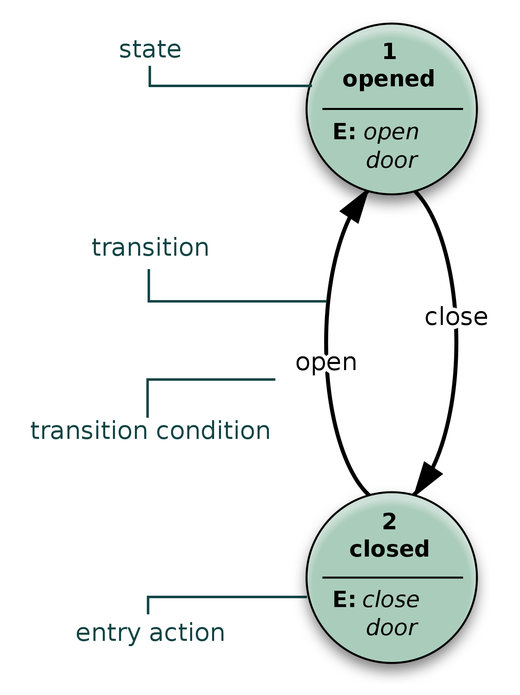

## Makkina. Kotlin multiplatform Finite State Machine

If you're looking for a library that brings you well-designed solution to use 
[the FiniteStateMachine approach](https://en.wikipedia.org/wiki/Finite-state_machine) in
your kotlin/kotlin multiplatform project then you came to the right spot.
This is the makkina lib (the name comes from italian macchina but with slightly changes 
with regard of the kotlin community)

## Concept
The concept is quite simple. You have some object with a limited set of possible states.
In the current moment of the time it must be only in one possible state. The transition 
is possible via the transition function `(STATE1, EVENT) -> STATE2`. Additionally, you
can have some side effects happening by transition as `(STATE1, STATE2) -> Unit`. All 
this is described via the transition diagram. For example (a pic is taken from 
[the wikipedia page]((https://en.wikipedia.org/wiki/Finite-state_machine))): 



## Description of Makkina

If we emulate the process of opening/closing the door we could have the following state:
```kotlin
sealed interface DoorState {
    object Open : DoorState
    object Closed : DoorState
    // intermediate state when a process is in progress
    object Opening : DoorState
    // intermediate state when a process is in progress
    object Closing : DoorState 
}
```

And according to this our events:
```kotlin
sealed interface DoorEvent {
    object OpenEvent : DoorEvent
    object CloseEvent : DoorEvent
}
```

In this case we can describe our state makkina:
```kotlin
private val executor = Executors.newSingleThreadExecutor()

private val makkina = Makkina {
    initialState(DoorState.Closed)

    state<DoorState.Closed> {
        onEvent<DoorEvent.OpenEvent> { _, _ -> doOpenDoor() }
    }

    state<DoorState.Open> {
        onEvent<DoorEvent.CloseEvent> { _, _ -> doCloseDoor() }
    }

    transitions {
        onAny { fromState, toState ->
            // Let's print into console the transition
            println("Door is coming from ${fromState::class.simpleName} to ${toState::class.simpleName}")
        }
    }
}

private fun doCloseDoor(): DoorState.Closing {
    executor.execute {
        // Emulate long running task
        Thread.sleep(1000)
        makkina.transitionTo(DoorState.Closed)
    }

    return DoorState.Closing
}

private fun doOpenDoor(): DoorState {
    executor.execute {
        // Emulate long running task
        Thread.sleep(1000)
        makkina.transitionTo(DoorState.Open)
    }

    return DoorState.Opening
}
```

Let's create Door class as a wrapper over our makkina:
```kotlin
class Door {

    private val executor = TODO()

    private val makkina = TODO()

    fun open() {
        makkina.sendEvent(DoorEvent.OpenEvent)
    }

    fun close() {
        makkina.sendEvent(DoorEvent.CloseEvent)
    }
}
```

Then let's test it with simple console app:

```kotlin
fun main() {
    val door = Door()

    door.open()

    // If we do door close it won't happen cause opening is in process
    door.close()

    // But if we wait until operation done and state comes to open we can do it
    Thread.sleep(1100)
    door.close()
}
```

If you run this you should see this:
```
Door is coming from Closed to Opening
Door is coming from Opening to Open
Door is coming from Open to Closing
Door is coming from Closing to Closed
```

Looks clean and simple, right?